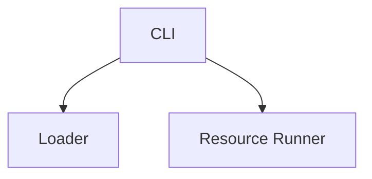

# Media Assets

This folder holds diagrams and screenshots for the GitHub README and docs.

## Diagrams (Mermaid)

- diagrams/architecture.mmd
- diagrams/dataflow.mmd

These are text-based Mermaid diagrams rendered by GitHub automatically when embedded in Markdown using fenced code blocks:

```mermaid
<!-- paste the contents of a .mmd file here or include inline mermaid -->
```

## Screenshots (to be added)

Place image files (PNG/JPG/GIF) in `images/`:

Recommended filenames:
- images/cli-modules-list.png
- images/resource-run.png
- images/report-index.png
- images/social-preview.png (use in GitHub → Settings → Social preview)

Guidelines:
- Prefer 1200x630 for social preview (Open Graph).
- Use light background for best contrast with GitHub light/dark themes.
- Keep file sizes small (< 1 MB each).
- Do not include sensitive data. Use sanitized/demo outputs.

## Linking from README

Example Markdown:

```md


```

Alternatively, embed Mermaid directly:

