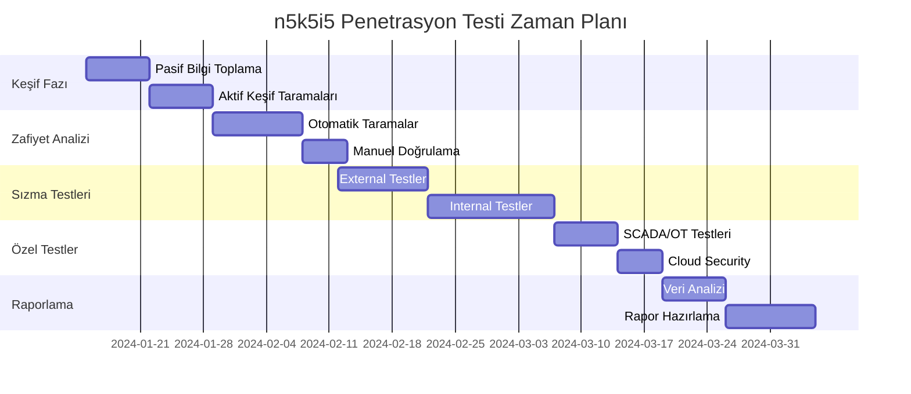

Proje Kodu: SH-PT-2024-Q1  
Gizlilik Seviyesi: Çok Gizli  
Hazırlanma Tarihi: 15.01.2024

Uyarı (Gizlilik)
- Bu doküman "Çok Gizli" sınıfındadır. Yalnızca yetkili kişilerce erişilebilir.
- Yetkisiz erişim, ifşa veya dağıtım yasa dışıdır ve yaptırıma tabidir.
- Tüm testler, yazılı onay ve yetkilendirme kapsamında, tanımlı zaman aralıklarında ve lab-first prensipleriyle icra edilmelidir.

---

1. PROJE ÖZETİ
===============

Test Kapsamı:

· Süre: 12 Hafta (3 Ay)  
· Test Türü: Sızma Testi + Zafiyet Değerlendirmesi  
· Metodoloji: OSSTMM, PTES, NIST SP 800-115  
· Hedefler: 7 ana başlık, 45 alt test senaryosu

Kritik Sistemler:

```markdown
- Active Directory Forest (n5k5i5.local)
- SAP ERP System (ERP-SH01)
- SWIFT Alliance (AKBANK-SWIFT)
- SCADA Systems (ENERSA-OT)
- Cloud Infrastructure (AWS, Azure)
- Web Portallar (16 adet)
```

---

2. DETAYLI TEST PLANI
=====================

FAZ 1: KEŞİF ve BİLGİ TOPLAMA (Hafta 1-2)
-----------------------------------------

A. Pasif Bilgi Toplama

```bash
# WHOIS ve DNS Bilgileri
whois n5k5i5.com
dig ANY n5k5i5.com
nslookup -type=MX n5k5i5.com

# Subdomain Keşfi
subfinder -d n5k5i5.com
amass enum -passive -d n5k5i5.com

# Sosyal Medya ve OSINT
theHarvester -d n5k5i5.com -b google,linkedin
```

B. Aktif Keşif

```bash
# Network Range Tarama
nmap -sn 195.87.0.0/16
masscan -p1-65535 195.87.0.0/16 --rate=1000

# Port ve Servis Keşfi
nmap -sS -sV -O -A 195.87.1.1-254
```

Çıktılar:

· Network haritası  
· DNS yapısı raporu  
· Açık port ve servis envanteri

---

FAZ 2: ZAFİYET TARAMA (Hafta 3-4)
---------------------------------

A. Otomatik Zafiyet Tarama

```bash
# Nessus Enterprise Tarama
nessus --target 195.87.0.0/16 --policy "enterprise_scan"

# OpenVAS Komple Tarama
openvas-cli --target=195.87.1.0/24 --port-range=1-65535

# Web Uygulama Güvenlik Testi
burpsuite --scan --target https://*.n5k5i5.com
```

B. Manuel Zafiyet Değerlendirmesi

```bash
# SSH Servis Zafiyetleri
nmap --script ssh2-enum-algos,ssh-auth-methods

# Database Zafiyetleri
nmap --script mysql-vuln*,oracle-tns-vuln*

# Windows-specific Zafiyetler
nmap --script smb-vuln*,msrpc-vuln*
```

Risk Skorlama:

· CVSS v3.1 kullanılarak  
· Önceliklendirme matrisi

---

FAZ 3: SIZMA TESTİ (Hafta 5-8)
------------------------------

A. External Penetration

```bash
# Web Uygulama Testleri
sqlmap -u "https://portal.n5k5i5.com/login" --level=5
nikto -h https://portal.n5k5i5.com -C all

# API Güvenlik Testi
owasp-zap -t https://api.n5k5i5.com -s
```

B. Internal Network Penetration

```bash
# Active Directory Testleri
bloodhound-python -d n5k5i5.local -c All
kerbrute userenum --dc DC01.n5k5i5.local users.txt

# Lateral Movement Simülasyonu
crackmapexec smb 195.87.1.0/24 -u users.txt -p passwords.txt
```

C. Phishing Simülasyonu (Onaylı)

```python
# Senaryo 1: HR Departmanı phishing
target_groups = ["hr@n5k5i5.com", "finans@n5k5i5.com"]
phishing_template = "Salary_Update_2024.html"

# Senaryo 2: Yönetici spear phishing
executive_targets = ["ceo@n5k5i5.com", "cio@n5k5i5.com"]
custom_template = "Board_Meeting_Minutes.pdf"
```

---

FAZ 4: POST-EXPLOITATION (Hafta 9)
----------------------------------

A. Privilege Escalation

```bash
# Windows Privilege Escalation
windows-exploit-suggester.py --database 2024.csv --systeminfo system.txt

# Linux Privilege Escalation
linpeas.sh
linux-exploit-suggester.sh
```

B. Persistence Mekanizmaları

```bash
# Backdoor Yerleştirme (Test Amaçlı)
metasploit -> persistence module
# Golden Ticket Attack (AD)
mimikatz # kerberos::golden
```

C. Data Exfiltration Simülasyonu

```bash
# Hassas Veri Keşfi
find / -name "*.pdf" -o -name "*.xlsx" | grep -i "secret\\|confidential"

# Exfiltration Testi
# DNS Tunneling (test amaçlı)
# HTTPS üzerinden veri transferi
```

---

FAZ 5: ÖZEL SİSTEM TESTLERİ (Hafta 10)
--------------------------------------

A. SCADA/OT Systems (Sınırlı Kapsam)

```bash
# Modbus Protocol Test
nmap --script modbus-discover -p 502 195.87.10.0/24

# ICS/SCADA Zafiyet Tarama
# Özel izin gerektiren testler
```

B. Mobile Application Security

```bash
# iOS/Android Uygulama Testi
mobsf --apk n5k5i5-mobile.apk
frida --analyze com.n5k5i5.mobile
```

C. Cloud Security Assessment

```bash
# AWS Misconfiguration
pacuv --aws-profile n5k5i5-prod
# Azure Security Scan
azscan --tenant n5k5i5holding
```

---

FAZ 6: RAPORLAMA (Hafta 11-12)
------------------------------

A. Risk Değerlendirme Matrisi

Risk Seviyesi | Sayı | Öncelik  
------------- | ---- | --------  
Kritik        | 0    | 24 Saat  
Yüksek        | 0    | 7 Gün  
Orta          | 0    | 30 Gün  
Düşük         | 0    | 90 Gün

B. Rapor Yapısı

```markdown
1. Executive Summary (10 sayfa)
2. Teknik Detay Raporu (150+ sayfa)
3. Remediation Planı (Excel tablosu)
4. Pentest Evidence (Ekran görüntüleri, loglar)
5. Öneriler ve Roadmap
```

---

3. ZAMAN ÇİZELGESİ
==================



---

4. TEST KURALLARI ve SINIRLAMALAR
=================================

Yasaklı Hareketler:

· ❌ DDOS/Service interruption  
· ❌ Production veri değişikliği  
· ❌ Müşteri verilerine erişim  
· ❌ Test saatleri dışında çalışma (09:00-18:00)

İzin Verilenler:

· ✅ Read-only erişim (veri okuma)  
· ✅ Test hesapları kullanımı  
· ✅ Backup sistemlerde test  
· ✅ Onaylı zaman aralıklarında çalışma

---

5. İLETİŞİM ve ESCALATION
=========================

Aciliyet Seviyeleri:

```markdown
# SEV1 (Kritik): Hemen müdahale gerektiren açıklık
- İletişim: CISO → CIO → Yönetim Kurulu
- Süre: 2 saat içinde response

# SEV2 (Yüksek): Haftalık raporlama
- İletişim: Security Team → Department Manager
- Süre: 7 gün içinde fix

# SEV3 (Orta): Aylık raporlama
- İletişim: Regular reporting
- Süre: 30 gün içinde çözüm
```

---

6. KABUL KRİTERLERİ
===================

Başarı Metrikleri:

· ✅ Tüm scope sistemler test edildi  
· ✅ CVSS skoru 4.0+ tüm zafiyetler bulundu  
· ✅ Remediation planı sunuldu  
· ✅ Executive summary onaylandı

Kapanış Kriterleri:

· Tüm kritik zafiyetler kapatıldı  
· Retest tamamlandı  
· Final raporu teslim edildi  
· Lessons learned workshop yapıldı

---

Onaylayanlar:

· n5k5i5 CISO: _________________  
· Test Lideri: _________________  
· Proje Yöneticisi: _________________

Bu plan 15.01.2024 tarihinde onaylanmıştır.

Notlar
- Bu planın uygulanması, ilgili yetki ve izinlere tabidir. Üretim sistemlerinde kesinti, veri değişikliği veya müşteri verilerine erişim kesinlikle yasaktır.
- Tüm aktiviteler kayıt altına alınmalı ve etik kullanım sözleşmesi (EULA) ile uyumlu olmalıdır.